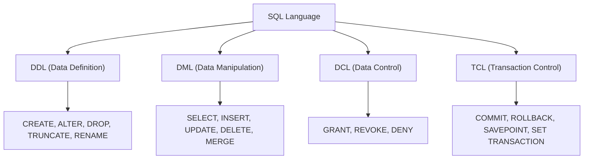
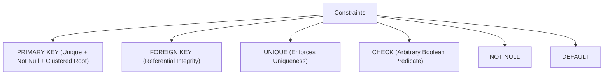

# Stage 1: Relational Foundations, Set vs. Bag Theory, Data Types & Integrity Constraints

---

## 1. The Relational Model & Relational Calculus

The relational model (formulated by E.F. Codd in 1970) represents data mathematically as **Relations** over **Domains**.

### Key Mathematical Terminology vs. SQL Equivalents:

| Mathematical / Relational Term | SQL Equivalent | Description |
| :--- | :--- | :--- |
| **Relation** | Table / View | A set of tuples sharing a schema. |
| **Tuple** | Row / Record | An ordered list of attribute values. |
| **Attribute** | Column / Field | A named property taking values from a domain. |
| **Domain** | Data Type & Constraints | The set of permissible atomic values. |
| **Degree (Arity)** | Column Count | Number of attributes in the relation. |
| **Cardinality** | Row Count | Number of tuples currently in the relation. |

---

## 2. Set Theory vs. Multiset (Bag) Theory in SQL

- **Pure Relational Theory (Set Theory)**:
  - Sets contain **no duplicate elements**.
  - Sets have **no inherent ordering** (order is meaningless).
- **Practical SQL (Multiset / Bag Theory)**:
  - Standard SQL tables and query results are **Multisets (Bags)**: they can contain duplicate rows (unless a `PRIMARY KEY`, `UNIQUE` constraint, or `DISTINCT` is enforced).
  - SQL provides explicit set operators (`UNION`, `INTERSECT`, `EXCEPT`) that eliminate duplicates, as well as bag operators (`UNION ALL`, `INTERSECT ALL`, `EXCEPT ALL`) that preserve duplicates.

---

## 3. SQL Sublanguages Taxonomy: DDL, DML, DCL, TCL



### Deep Dive: `TRUNCATE` vs. `DELETE` (Critical Interview Topic)

| Feature | `DELETE` | `TRUNCATE` |
| :--- | :--- | :--- |
| **Sublanguage** | DML | DDL |
| **Row Filtering** | Supports `WHERE` clause for selective row deletion. | Removes **all** rows unconditionally. |
| **Logging Mechanism** | **Fully Logged**: Every individual row deletion and index update is written to the Transaction Log / WAL. | **Minimally Logged / Deallocation**: Logs only extent/page deallocations, NOT individual rows. |
| **Performance** | Slow for large tables ($O(N)$ row locks and log writes). | ⚡ **Instantaneous** ($O(1)$ page pointer deallocation). |
| **High Water Mark (HWM)** | Does **not** reset the High Water Mark (table file size on disk is not reclaimed). | **Resets the High Water Mark** (frees pages back to the database engine). |
| **Identity / Auto-Increment** | Does **not** reset the identity seed (next insert continues from last value). | **Resets identity counter** back to its initial seed. |
| **Triggers** | Fires `ON DELETE` row-level triggers. | **Bypasses** all `DELETE` triggers (never fires). |
| **Foreign Keys** | Permitted if child rows are handled via `CASCADE` or no references exist. | **Disallowed** if referenced by ANY active Foreign Key, even if the child table is empty! |
| **Rollback Capability** | Fully rollback-safe within an active transaction (`ROLLBACK;`). | **Rollback-safe** inside a transaction in standard engines (Postgres, SQL Server, Oracle). *(MySql MyISAM tables cannot rollback).* |

---

## 4. SQL Data Types & Storage Internals

### 1. Exact vs. Approximate Numerics
- **Exact Fixed-Point (`DECIMAL(p, s)` / `NUMERIC(p, s)`)**:
  - $p$ = Precision (total count of significant digits, $1 \dots 38$).
  - $s$ = Scale (number of digits to the right of the decimal point).
  - Stored as packed binary integers; guarantees exact decimal arithmetic (critical for financial ledgers, monetary balances).
- **Approximate Floating-Point (`FLOAT`, `REAL`, `DOUBLE PRECISION`)**:
  - Stored using IEEE 754 standard binary floating-point representation.
  - **The Trap**: Cannot represent certain base-10 fractions exactly.
    $$\text{In Floating Point: } 0.1 + 0.2 \ne 0.3 \implies 0.3000000000000000444\dots$$
    *Never use `FLOAT` for currencies, financial accounts, or equality comparisons (`WHERE price = 19.99` can silently fail!).*

---

### 2. Character Data Types & Collations
- **`CHAR(n)`**: Fixed-length string. If string length $< n$, it is right-padded with spaces. Space-inefficient for variable content, but avoids page fragmentation if column values are updated frequently with identical lengths.
- **`VARCHAR(n)`**: Variable-length string with a 1- or 2-byte length prefix.
- **`TEXT` / `CLOB`**: Large object storage. When payload exceeds page limit (e.g. 8KB page size), the engine stores data **Out-of-Row** (TOAST in PostgreSQL, LOB storage in SQL Server), leaving a 24-byte pointer in the main page.
- **Collations**: Define sorting and comparison rules:
  - Case-sensitivity (`_CS` vs `_CI`).
  - Accent-sensitivity (`_AS` vs `_AI`).
  - Character set encoding (`UTF-8`, `UTF-16`).

---

### 3. Temporal Types & Timezone Handling
- **`DATE`**: 4 bytes, stores Calendar Date (`YYYY-MM-DD`).
- **`TIME`**: Stores time of day with fractional seconds.
- **`DATETIME` / `TIMESTAMP WITHOUT TIME ZONE`**: Stores raw timestamp literal without geographical context. Ambiguous during Daylight Saving Time (DST) transitions.
- **`TIMESTAMP WITH TIME ZONE` (`TIMESTAMPTZ`)**:
  - **PostgreSQL / Snowflake / BigQuery Behavior**: Converts the incoming client timestamp to **UTC** upon storage. Upon query, converts UTC back to the client's session timezone.
  - **Best Practice in Data Engineering**: Always ingest, process, and store event data in **UTC (`TIMESTAMPTZ`)** to eliminate DST jumps and timezone drift.

---

### 4. Semi-Structured Data: `JSON` vs. `JSONB` (PostgreSQL / Snowflake Variant)

| Feature | `JSON` (Plain Text) | `JSONB` (Binary Decomposed JSON) |
| :--- | :--- | :--- |
| **Storage** | Stored as exact raw text (preserves whitespace and key ordering). | Stored in parsed, binary tree format (strips whitespace, deduplicates keys). |
| **Write Performance** | ⚡ Fast (Raw string copy, no validation parsing overhead). | Slower (Requires parsing into binary tree on insert). |
| **Read / Query Performance** | 🐢 Slow (Must re-parse full text on every query/operator). | ⚡ **Blazing Fast** (Direct binary key lookup without parsing). |
| **Indexing Support** | Cannot index nested keys directly (must use expression indexes). | **Supports GIN (Generalized Inverted Indexes)** for path searches (`@>`, `?`, `?&`). |

---

## 5. Integrity Constraints & Referential Actions



### 1. `PRIMARY KEY` vs. `UNIQUE` Constraint:
- **`PRIMARY KEY`**:
  - Enforces `UNIQUE` + `NOT NULL` automatically.
  - Only **one** `PRIMARY KEY` allowed per table.
  - Automatically creates a unique index (defaults to Clustered in MySQL/SQL Server).
- **`UNIQUE` Constraint**:
  - Multiple `UNIQUE` constraints allowed per table.
  - **The NULL Handling Difference Across Engines**:
    - **ANSI SQL Standard / PostgreSQL / Oracle / Snowflake**: Allows **multiple `NULL` values** in a `UNIQUE` column (because `NULL != NULL`, each `NULL` is considered distinct).
    - **Microsoft SQL Server (Traditional)**: Allows **only ONE `NULL` value**! A second `NULL` triggers a unique constraint violation error. *(Workaround: Create a filtered unique index: `CREATE UNIQUE INDEX idx_uq ON tbl(col) WHERE col IS NOT NULL;`).*

---

### 2. `FOREIGN KEY` Referential Actions (`ON DELETE` / `ON UPDATE`):

When a referenced parent row is deleted or updated:
- **`CASCADE`**: Automatically deletes/updates all corresponding child rows in the referencing table.
- **`RESTRICT`**: Immediately aborts the parent deletion if any matching child rows exist (checked before triggers/statement execution).
- **`NO ACTION`**: Similar to `RESTRICT`, but in engines supporting **Deferrable Constraints** (Postgres/Oracle), the check is deferred until the end of the transaction (`DEFERRABLE INITIALLY DEFERRED`).
- **`SET NULL`**: Sets the child foreign key column to `NULL` (requires child column to allow NULLs).
- **`SET DEFAULT`**: Sets the child foreign key column to its defined column default value.

---

### 3. The `CHECK` Constraint & The 3VL Trap

A `CHECK` constraint validates an expression for all inserted/updated rows:
```sql
ALTER TABLE Employees ADD CONSTRAINT chk_salary CHECK (salary > 0);
```

> ⚠️ **The Critical Trap**: A `CHECK` constraint is satisfied if the condition evaluates to **`TRUE` OR `UNKNOWN`**! It ONLY rejects rows if the condition evaluates strictly to **`FALSE`**.

- If an employee is inserted with `salary = NULL`:
  $$\text{salary} > 0 \implies \text{NULL} > 0 \implies \mathbf{UNKNOWN}$$
- Since the result is `UNKNOWN` (not `FALSE`), **the insert succeeds**!
- To prevent this, always combine with `NOT NULL`:
  ```sql
  salary DECIMAL(12,2) NOT NULL CHECK (salary > 0)
  ```

---

## 🎯 Stage 1 Interview Flash-Checks & Boss Questions

1. **Question**: *Why is `TRUNCATE` faster than `DELETE FROM table`, and can `TRUNCATE` be rolled back in a transaction in PostgreSQL / SQL Server?*
   - **Answer**: `TRUNCATE` operates at the page allocation level, deallocating the extent pointers and resetting the high water mark rather than traversing each row and recording individual row deletions in the WAL/transaction log. Yes, inside an explicit transaction block (`BEGIN; TRUNCATE tbl; ROLLBACK;`), modern engines (Postgres, SQL Server, Oracle) can safely roll back `TRUNCATE` because they record the metadata page deallocations in the log.
2. **Question**: *What is the subtle bug in using `FLOAT` for monetary calculations in a data warehouse?*
   - **Answer**: `FLOAT` uses binary IEEE 754 floating-point arithmetic. Base-10 fractions (like 0.1, 0.05) cannot be represented with finite binary digits, introducing rounding errors that cause ledger reconciliation discrepancies and failed equality comparisons. Always use exact `DECIMAL(p,s)` for financial metrics.
3. **Question**: *How does a `CHECK (age >= 18)` constraint behave when `age` is `NULL`?*
   - **Answer**: It evaluates to `UNKNOWN`. In SQL, `CHECK` constraints accept both `TRUE` and `UNKNOWN`, so the row is accepted unless explicit `NOT NULL` is added.
