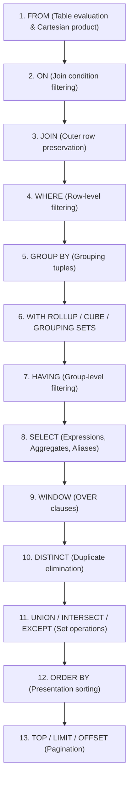

# Stage 2: Logical Query Processing, Three-Valued Logic (3VL) & SARGability

---

## 1. The 11-Step Logical Execution Order

In imperative programming (Python, C++), code runs line-by-line in the exact lexical order written. In declarative SQL, the database engine executes clauses in a strict **Logical Query Processing Order** before passing the AST to the physical Cost-Based Optimizer (CBO).



### Critical Traps & Deep Internals:

#### 1. Why Aliases Fail in `WHERE` and `HAVING`:
```sql
SELECT price * quantity AS total_revenue 
FROM Sales 
WHERE total_revenue > 1000; -- ❌ Syntax Error in Standard SQL!
```
- **Why**: `WHERE` is evaluated at **Phase 4**, while the alias `total_revenue` is created in `SELECT` at **Phase 8**. The column name simply does not exist yet when `WHERE` executes!
- **Where are Aliases Legal?**:
  - Aliases defined in `SELECT` **ARE legal in `ORDER BY`** (Phase 12), because `ORDER BY` executes *after* `SELECT`.
- **Dialect Exceptions**: Modern OLAP data warehouses (Snowflake, Google BigQuery) use a query pre-processor that performs syntactic alias expansion in `WHERE`/`HAVING`, but standard OLTP engines (PostgreSQL, SQL Server, Oracle, MySQL 5.7) strictly enforce the ANSI execution order.

---

#### 2. The Short-Circuit Non-Guarantee (The Divide-by-Zero Hazard):
In procedural languages, boolean evaluations short-circuit from left to right (`if (A && B)` skips `B` if `A` is false).
**In SQL, the optimizer evaluates predicates in cost order, NOT written order!**

```sql
-- DANGEROUS:
SELECT * 
FROM Accounts 
WHERE divisor <> 0 AND (1000 / divisor) > 10;
```
If the optimizer estimates that `(1000 / divisor) > 10` is more selective or cheaper, it can evaluate it **before** `divisor <> 0`, throwing a **Division by Zero Exception** at runtime!

**The Bulletproof Fix**:
```sql
-- ANSI SQL guarantees conditional evaluation inside CASE expressions:
SELECT * 
FROM Accounts 
WHERE CASE WHEN divisor <> 0 THEN 1000 / NULLIF(divisor, 0) END > 10;
```

---

## 2. Three-Valued Logic (3VL) & The Mechanics of `NULL`

In relational theory (E.F. Codd), `NULL` represents **missing, unknown, or inapplicable information**. Because `NULL` is not a discrete value, equality comparisons like `NULL = NULL` evaluate to **`UNKNOWN`**, not `TRUE`.

### 3VL Boolean Truth Tables

```
              ┌────────────────────────────────────────────────────────┐
              │                Three-Valued Logic (3VL)                │
              └────────────────────────────────────────────────────────┘
```

| `AND` | `TRUE` | `FALSE` | `UNKNOWN` |
| :---: | :---: | :---: | :---: |
| **`TRUE`** | `TRUE` | `FALSE` | `UNKNOWN` |
| **`FALSE`** | `FALSE` | `FALSE` | **`FALSE`** |
| **`UNKNOWN`** | `UNKNOWN` | **`FALSE`** | `UNKNOWN` |

| `OR` | `TRUE` | `FALSE` | `UNKNOWN` |
| :---: | :---: | :---: | :---: |
| **`TRUE`** | `TRUE` | **`TRUE`** | **`TRUE`** |
| **`FALSE`** | **`TRUE`** | `FALSE` | `UNKNOWN` |
| **`UNKNOWN`** | **`TRUE`** | `UNKNOWN` | `UNKNOWN` |

| `NOT` | Input | Output |
| :---: | :---: | :---: |
| | `TRUE` | `FALSE` |
| | `FALSE` | `TRUE` |
| | `UNKNOWN` | `UNKNOWN` |

---

### The Filter Acceptance Rule: `WHERE` vs. `CHECK`

- **`WHERE` / `HAVING` / `ON` Clauses**:
  - Accept rows ONLY when the predicate evaluates strictly to **`TRUE`**.
  - Rows evaluating to `FALSE` or `UNKNOWN` are silently filtered out.
- **`CHECK` Constraints**:
  - Reject rows ONLY when the predicate evaluates strictly to **`FALSE`**.
  - Rows evaluating to `TRUE` OR `UNKNOWN` are accepted.

---

## 3. The Wilderness Boss: `NOT IN` vs. `NOT EXISTS` with `NULL`s

### The Scenario:
Find all customers who have **never placed an order**.

```sql
-- DANGEROUS ANTI-PATTERN:
SELECT customer_id, name 
FROM Customers 
WHERE customer_id NOT IN (SELECT customer_id FROM Orders);
```

### The Failure:
If `Orders.customer_id` contains even a **single row with `NULL`**, this query returns **0 rows**, even if there are 1,000,000 customers who never placed an order!

### Mathematical Proof:
Suppose `Orders` has `customer_id` values: `{101, 102, NULL}`.
The predicate `customer_id NOT IN (101, 102, NULL)` expands logically to:
$$\text{customer\_id} \ne 101 \text{ AND } \text{customer\_id} \ne 102 \text{ AND } \text{customer\_id} \ne \text{NULL}$$

1. **For a customer with `customer_id = 999` (who never ordered)**:
   - `999 != 101` $\implies$ `TRUE`
   - `999 != 102` $\implies$ `TRUE`
   - `999 != NULL` $\implies$ `UNKNOWN`
   - Combined: $\text{TRUE AND TRUE AND UNKNOWN} \implies \mathbf{UNKNOWN}$
2. **For a customer with `customer_id = 101` (who did order)**:
   - `101 != 101` $\implies$ `FALSE`
   - Combined: $\text{FALSE AND TRUE AND UNKNOWN} \implies \mathbf{FALSE}$

Because the result for any non-matching customer is `UNKNOWN`, and `WHERE` requires `TRUE`, **every single row is discarded!**

### The Production Solutions:
```sql
-- Solution 1: NOT EXISTS (NULL-Safe, short-circuits instantly on match)
SELECT c.customer_id, c.name 
FROM Customers c 
WHERE NOT EXISTS (
    SELECT 1 FROM Orders o WHERE o.customer_id = c.customer_id
);

-- Solution 2: Left Anti-Join (Set-based)
SELECT c.customer_id, c.name 
FROM Customers c 
LEFT JOIN Orders o ON c.customer_id = o.customer_id 
WHERE o.customer_id IS NULL;
```

---

## 4. Null-Safe Equality: `IS NOT DISTINCT FROM` (ANSI Standard)

In standard SQL, comparing `A = B` returns `UNKNOWN` when either side is `NULL`.
When joining or deduplicating data where two `NULL`s should match:

```sql
-- ANSI Standard (PostgreSQL, Snowflake, DuckDB):
SELECT * 
FROM TableA a 
JOIN TableB b 
  ON a.col1 IS NOT DISTINCT FROM b.col1;

-- MySQL Equivalent:
ON a.col1 <=> b.col1

-- SQL Server Equivalent:
ON (a.col1 = b.col1 OR (a.col1 IS NULL AND b.col1 IS NULL))
```

---

## 5. Predicates & Pattern Matching

### 1. `BETWEEN ... AND ...` Boundary Pitfalls
- `BETWEEN` is **inclusive** on both endpoints: `col BETWEEN A AND B` $\iff$ `col >= A AND col <= B`.
- **Temporal Trap with `TIMESTAMP`**:
  ```sql
  -- BUGGY: Misses all events on Jan 31 after 00:00:00!
  WHERE event_timestamp BETWEEN '2026-01-01' AND '2026-01-31'
  
  -- SARGABLE BEST PRACTICE (Half-Open Interval):
  WHERE event_timestamp >= '2026-01-01' AND event_timestamp < '2026-02-01'
  ```

---

### 2. `LIKE`, Wildcards & `ESCAPE`
- `%` matches 0 or more characters.
- `_` matches exactly 1 character.
- **Searching for literal `%` or `_`**:
  ```sql
  -- Find discounts containing literal '10%':
  SELECT * FROM Promotions WHERE promo_name LIKE '%10\%%' ESCAPE '\';
  ```
- **Case-Insensitive Pattern Matching**:
  - PostgreSQL: `ILIKE`
  - SQL Server / MySQL: Handled via case-insensitive collation (`_CI`).
  - Standard Regex: `WHERE REGEXP_LIKE(email, '^[A-Za-z0-9._%+-]+@[A-Za-z0-9.-]+\.[A-Za-z]{2,}$')`

---

## 6. SARGability (Search Argumentable Predicates)

A predicate is **SARGable** (Search Argument Able) if the optimizer can directly traverse a B+Tree index using an **Index Seek** (logarithmic time $O(\log N)$) rather than scanning every page via a **Full Table/Index Scan** ($O(N)$).

```
                ┌────────────────────────────────────────────────────────┐
                │             The SARGability Decision Matrix            │
                └────────────────────────────────────────────────────────┘
```

| Non-SARGable (Forces Full Table Scan ❌) | SARGable Rewrite (Enables Index Seek ⚡) | Root Cause of Index Invalidation |
| :--- | :--- | :--- |
| `WHERE YEAR(order_date) = 2026` | `WHERE order_date >= '2026-01-01' AND order_date < '2027-01-01'` | Wrapping indexed column in a function prevents B+Tree key search. |
| `WHERE UPPER(last_name) = 'SMITH'` | Use functional/computed index or case-insensitive collation. | Function transforms column value for every row. |
| `WHERE balance + 50 > 500` | `WHERE balance > 450` | Arithmetic on column breaks direct key comparison. |
| `WHERE phone_number LIKE '%5551234'` | Store reversed string + index `WHERE reversed_phone LIKE '4321555%'` | Leading wildcard forces engine to inspect every string suffix. |
| `WHERE COALESCE(status, 'PENDING') = 'PENDING'` | `WHERE status = 'PENDING' OR status IS NULL` | `COALESCE` scalar evaluation hides original indexed key. |
| `WHERE varchar_zipcode = 90210` *(Implicit Cast)* | `WHERE varchar_zipcode = '90210'` | Numeric literal forces engine to execute `CAST(varchar_zipcode AS INT)` on every row! |

---

## 🎯 Stage 2 Interview Flash-Checks & Boss Questions

1. **Question**: *Can a window function `ROW_NUMBER() OVER (...)` be evaluated inside a `WHERE` or `HAVING` clause?*
   - **Answer**: **No.** Window functions are evaluated in **Phase 9**, *after* `WHERE` (Phase 4) and `HAVING` (Phase 7). To filter on a window metric, you must encapsulate the query in a CTE or subquery (e.g., `WITH Ranked AS (...) SELECT * FROM Ranked WHERE rn = 1`).
2. **Question**: *Why does `SELECT COUNT(*) ...` differ from `SELECT COUNT(column) ...` when the column contains `NULL`s?*
   - **Answer**: `COUNT(*)` counts total physical rows regardless of column values (it never evaluates nullability). `COUNT(column)` only increments for rows where `column IS NOT NULL`.
3. **Question**: *If an index exists on `created_at (TIMESTAMP)`, why is `WHERE created_at::DATE = '2026-08-21'` an anti-pattern?*
   - **Answer**: Casting `created_at::DATE` destroys SARGability, forcing a Full Index Scan / Table Scan over millions of rows. It must be rewritten as the half-open range: `WHERE created_at >= '2026-08-21 00:00:00' AND created_at < '2026-08-22 00:00:00'`.
