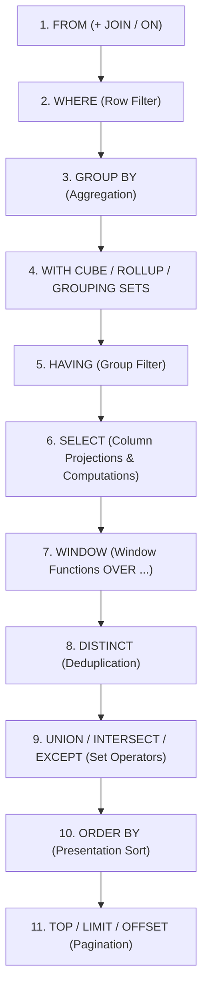

# Module 01: SQL Execution Pipeline, Logical Processing & Three-Valued Logic (3VL)

---

## 1. Logical Query Processing Order

Unlike procedural code executed top-to-bottom, SQL is declarative. The relational engine translates your query into a logical processing pipeline before the cost-based optimizer (CBO) creates the physical execution plan.



### Key Traps & Deep Internals:
1. **Alias Invalidation in `WHERE` and `HAVING`**:
   - In standard ANSI SQL, column aliases defined in `SELECT` (Phase 6) are invisible in `WHERE` (Phase 2) and `HAVING` (Phase 5).
   - *Engine exception*: Snowflake and Google BigQuery implement syntactic extensions allowing alias references in `WHERE`/`HAVING`, but standard SQL engines (Postgres, SQL Server, Oracle) reject this.
2. **`ON` vs `WHERE` in Outer Joins (The Accidental Inner Join)**:
   - `ON` applies filtering *during* row generation for the join.
   - `WHERE` applies filtering *after* the outer join has already preserved unmatched rows with `NULL`.
   - **Trap**: Placing a filter on the right table in the `WHERE` clause (e.g., `WHERE right_table.status = 'ACTIVE'`) converts a `LEFT JOIN` into an `INNER JOIN` because `NULL = 'ACTIVE'` evaluates to `UNKNOWN`, discarding all preserved unmatched left rows!
3. **No Short-Circuit Evaluation Guarantee**:
   - In languages like Python/C++, `if (A && B)` guarantees `B` is not evaluated if `A` is false.
   - **In SQL, the optimizer is free to reorder boolean expressions in `WHERE`!**
   - *Example*:
     ```sql
     WHERE col <> 0 AND (100 / col) > 5
     ```
     Even though `col <> 0` comes first, the optimizer might evaluate `(100 / col) > 5` first, causing a **Divide by Zero exception**!
   - *Remedy*: Use `CASE WHEN col <> 0 THEN 100 / NULLIF(col, 0) END > 5` (ANSI SQL guarantees `CASE` branches evaluate conditionally).

---

## 2. Three-Valued Logic (3VL) & The Mechanics of `NULL`

In relational theory (Codd), `NULL` represents a **missing, unknown, or inapplicable value**, NOT zero or an empty string. Every boolean comparison with `NULL` produces `UNKNOWN`.

### 3VL Truth Tables

| Operator | Left Operand | Right Operand | Result |
| :--- | :--- | :--- | :--- |
| **AND** | `TRUE` | `UNKNOWN` | `UNKNOWN` |
| **AND** | `FALSE` | `UNKNOWN` | **`FALSE`** (determinate) |
| **OR** | `TRUE` | `UNKNOWN` | **`TRUE`** (determinate) |
| **OR** | `FALSE` | `UNKNOWN` | `UNKNOWN` |
| **NOT** | `UNKNOWN` | — | `UNKNOWN` |

> ⚠️ **The Filter Rule**: A `WHERE` or `HAVING` clause only accepts rows where the condition evaluates strictly to **`TRUE`**. Rows evaluating to `FALSE` or `UNKNOWN` are eliminated.

---

## 3. The Wilderness Boss: `NOT IN` vs `NOT EXISTS` with NULLs

### The Trap:
Consider checking for employees who have never placed an order:
```sql
SELECT employee_id 
FROM Employees 
WHERE employee_id NOT IN (SELECT employee_id FROM Orders);
```

**The Fatal Flaw**: If `Orders.employee_id` contains **even a single `NULL` value**, this query returns **0 rows**, regardless of how many employees exist.

### Mathematical Proof:
`employee_id NOT IN (101, 102, NULL)` expands logically to:
$$\text{employee\_id} \ne 101 \text{ AND } \text{employee\_id} \ne 102 \text{ AND } \text{employee\_id} \ne \text{NULL}$$

1. If `employee_id = 999`:
   $$\text{TRUE AND TRUE AND UNKNOWN} \implies \mathbf{UNKNOWN}$$
2. If `employee_id = 101`:
   $$\text{FALSE AND TRUE AND UNKNOWN} \implies \mathbf{FALSE}$$

In **no case** can the expression evaluate to `TRUE`. Thus, the entire result set is silently dropped.

### The Correct Patterns:
1. **`NOT EXISTS`** (Always safe against NULLs in subquery):
   ```sql
   SELECT e.employee_id 
   FROM Employees e 
   WHERE NOT EXISTS (
       SELECT 1 FROM Orders o WHERE o.employee_id = e.employee_id
   );
   ```
2. **Left Anti-Join**:
   ```sql
   SELECT e.employee_id 
   FROM Employees e 
   LEFT JOIN Orders o ON e.employee_id = o.employee_id
   WHERE o.employee_id IS NULL;
   ```

---

## 4. Aggregate Functions & NULL Behavior

| Aggregate | Behavior with NULLs | Special Edge Case |
| :--- | :--- | :--- |
| `COUNT(*)` | Counts all physical rows, including rows where all columns are `NULL`. | Never returns `NULL` (returns `0` on empty set). |
| `COUNT(col)` | Counts only non-NULL values in `col`. | Returns `0` if all values in partition are `NULL`. |
| `COUNT(DISTINCT col)` | Counts distinct non-NULL values. | Ignores `NULL` completely. |
| `SUM(col)`, `AVG(col)` | Ignores `NULL` values during accumulation. | **Returns `NULL` on an empty set or when all rows are `NULL`!** |

### Pitfall Example:
```sql
SELECT AVG(bonus) FROM Employees;
-- If 5 employees have bonuses: [100, 200, NULL, NULL, NULL]
-- AVG(bonus) = (100 + 200) / 2 = 150 (NOT 300 / 5 = 60!)
-- If you want NULL treated as 0: AVG(COALESCE(bonus, 0)) = 60
```

---

## 5. `IS DISTINCT FROM` vs `IS NOT DISTINCT FROM` (ANSI Standard)

In standard SQL, comparing `A = B` returns `UNKNOWN` when either `A` or `B` is `NULL`.
When implementing deduplication or join keys where two `NULL`s should be considered equal:

```sql
-- ANSI Standard NULL-safe equality:
WHERE col1 IS NOT DISTINCT FROM col2

-- Dialect equivalents:
-- MySQL: col1 <=> col2
-- Postgres/Snowflake: col1 IS NOT DISTINCT FROM col2
-- SQL Server: (col1 = col2 OR (col1 IS NULL AND col2 IS NULL))
```

---

## 6. SARGability (Search Argumentable Predicates)

A query is **SARGable** if the optimizer can utilize an index seek instead of a full table/index scan.

### SARGability Killers & Cures:

| Non-SARGable (Forces Full Table Scan) | SARGable Equivalent (Enables Index Seek) |
| :--- | :--- |
| `WHERE YEAR(created_at) = 2026` | `WHERE created_at >= '2026-01-01' AND created_at < '2027-01-01'` |
| `WHERE UPPER(email) = 'USER@EXAMPLE.COM'` | Use functional index or store normalized column |
| `WHERE amount + 10 > 100` | `WHERE amount > 90` |
| `WHERE phone LIKE '%1234'` | `WHERE phone LIKE '1234%'` (or reverse string index) |
| `WHERE COALESCE(status, 'NEW') = 'NEW'` | `WHERE (status = 'NEW' OR status IS NULL)` |
| `WHERE varchar_col = 123` (Implicit Cast) | `WHERE varchar_col = '123'` (Matching Data Types) |
