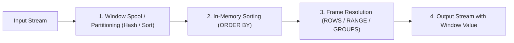

# Module 02: Window Function Internals & Framing Mechanics

---

## 1. Physical Execution Pipeline of Window Functions

Unlike `GROUP BY`, which collapses multiple rows into a single scalar group row, **Window Functions** compute aggregate or ranking metrics across a set of rows related to the current row while preserving the individual row identities.



### Execution Mechanics:
1. **Partitioning**: The engine sorts or hashes the input stream by the `PARTITION BY` columns.
2. **Ordering**: Within each partition, rows are sorted by `ORDER BY` columns.
3. **Framing**: For each row, the engine slides or expands a pointer buffer (the "frame") to aggregate or evaluate the window expression.
4. **Memory Hazard**: If a partition cannot fit into memory (`work_mem` in Postgres, TempDB in SQL Server, spill to disk in Snowflake/Spark), the engine spills to disk, causing massive I/O degradation.

---

## 2. The Dangerous Default: `ROWS` vs `RANGE` vs `GROUPS`

When an `ORDER BY` is present inside `OVER (...)` without an explicit framing clause, ANSI SQL applies a default framing clause:
$$\mathbf{RANGE\ BETWEEN\ UNBOUNDED\ PRECEDING\ AND\ CURRENT\ ROW}$$

```
                ┌──────────────────────────────────────────────────┐
                │             The Window Framing Matrix            │
                └──────────────────────────────────────────────────┘
```

| Framing Type | Evaluation Basis | Handling of Duplicate Ordering Values (Ties) | Performance Cost |
| :--- | :--- | :--- | :--- |
| **`ROWS`** | **Physical row offsets** from the current row. | Each row is evaluated individually. | ⚡ **Fast & O(1) buffer sliding** |
| **`RANGE`** | **Logical value offsets** based on column values. | **All rows with identical order values are included in the same frame!** | 🐢 **Slow (requires spooling & tie-scanning)** |
| **`GROUPS`** | **Offset of distinct groups of peer values**. | Counts peer groups rather than individual rows. | Moderate |

### The Silent Bug & Performance Trap:
Consider a running total:
```sql
SELECT 
    emp_id, salary,
    SUM(salary) OVER (ORDER BY salary) AS default_running_sum,
    SUM(salary) OVER (ORDER BY salary ROWS BETWEEN UNBOUNDED PRECEDING AND CURRENT ROW) AS explicit_running_sum
FROM Employees;
```

**Scenario**: Suppose salaries are `[1000, 2000, 2000, 3000]`.

| emp_id | salary | `default_running_sum` (`RANGE`) | `explicit_running_sum` (`ROWS`) | Why? |
| :---: | :---: | :---: | :---: | :--- |
| 1 | 1000 | 1000 | 1000 | Row 1 is unique |
| 2 | 2000 | **5000** | **3000** | `RANGE` includes ALL rows with salary=2000 in the current frame! |
| 3 | 2000 | **5000** | **5000** | Both rows 2 and 3 get the sum of (1000 + 2000 + 2000) = 5000 |
| 4 | 3000 | 8000 | 8000 | All rows included |

> 💡 **Golden Rule**: Always explicitly write `ROWS BETWEEN ...` for running totals unless you explicitly desire tie-accumulation.

---

## 3. Ranking Functions Comparison

| Function | Gap in Sequences? | Unique Rank on Ties? | Example Output for Salaries `[100, 200, 200, 300]` |
| :--- | :---: | :---: | :--- |
| **`ROW_NUMBER()`** | No | Yes (Arbitrary unless tied on unique key) | `1, 2, 3, 4` |
| **`RANK()`** | **Yes** | No (Ties share rank, skips subsequent) | `1, 2, 2, 4` |
| **`DENSE_RANK()`** | **No** | No (Ties share rank, no skips) | `1, 2, 2, 3` |
| **`NTILE(k)`** | No | No (Divides partition into $k$ buckets) | For $k=2$: `1, 1, 2, 2` |

### The Non-Determinism Trap with `ROW_NUMBER()`:
If `ORDER BY` does not uniquely identify a row:
```sql
SELECT emp_id, department_id, salary,
       ROW_NUMBER() OVER (PARTITION BY department_id ORDER BY salary DESC) as rn
FROM Employees;
```
If two employees in department 10 have the same salary, **their assigned rank is non-deterministic** across different runs or execution plans.
**Solution**: Always append a deterministic tie-breaker:
```sql
ROW_NUMBER() OVER (PARTITION BY department_id ORDER BY salary DESC, emp_id ASC)
```

---

## 4. The `LAST_VALUE()` Frame Trap

### The Problem:
Candidates often write:
```sql
-- WRONG: Intended to get the highest salary in the department
SELECT emp_id, department_id, salary,
       LAST_VALUE(salary) OVER (PARTITION BY department_id ORDER BY salary ASC) as highest_salary
FROM Employees;
```
**Result**: `LAST_VALUE(salary)` returns the `salary` of the **current row**, NOT the last row in the partition!

### Why?
Because the default frame is `RANGE BETWEEN UNBOUNDED PRECEDING AND CURRENT ROW`. The "last value" in a frame that ends at `CURRENT ROW` is simply the current row!

### The Fix:
```sql
-- CORRECT: Extend frame to the end of the partition
SELECT emp_id, department_id, salary,
       LAST_VALUE(salary) OVER (
           PARTITION BY department_id 
           ORDER BY salary ASC 
           ROWS BETWEEN CURRENT ROW AND UNBOUNDED FOLLOWING
       ) as highest_salary
FROM Employees;

-- OR SIMPLY USE FIRST_VALUE() IN REVERSE ORDER:
SELECT emp_id, department_id, salary,
       FIRST_VALUE(salary) OVER (
           PARTITION BY department_id 
           ORDER BY salary DESC
       ) as highest_salary
FROM Employees;
```

---

## 5. Offset Functions (`LEAD` / `LAG`) with Defaults

```sql
LAG(expression [, offset [, default]]) OVER ( [partition_clause] order_clause )
LEAD(expression [, offset [, default]]) OVER ( [partition_clause] order_clause )
```

- `offset`: Defaults to `1`.
- `default`: Defaults to `NULL`. **Specifying a default avoids wrapping with `COALESCE`**.

```sql
-- Calculate day-over-day revenue delta, defaulting to 0 for the first day:
SELECT 
    trade_date,
    revenue,
    revenue - LAG(revenue, 1, revenue) OVER (ORDER BY trade_date) AS daily_diff
FROM DailyRevenue;
```
