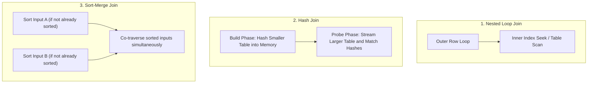
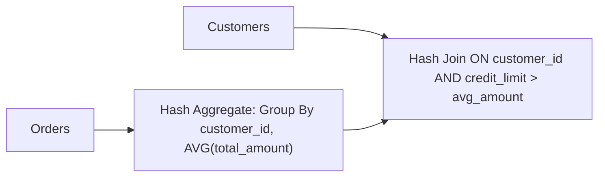

# Module 03: Optimizer Internals, Indexing & Physical Join Operators

---

## 1. Physical Join Algorithms Under the Hood

The Cost-Based Optimizer (CBO) evaluates table statistics, indexes, and predicates to select among three physical join algorithms:



### Deep Comparison Matrix:

| Join Algorithm | Time Complexity | Memory Requirements | Best Suited For | Critical Failure Mode |
| :--- | :--- | :--- | :--- | :--- |
| **Nested Loop (NL)** | $O(N \times \log M)$ with index, $O(N \times M)$ without | $O(1)$ (Minimal) | Small outer table joining against an indexed inner table. | High cardinality outer table without index $\implies O(N \times M)$ explosion. |
| **Hash Join** | $O(N + M)$ | $O(\text{Size of Build Input})$ | Large unsorted datasets, equi-joins, absence of useful indexes. | **Grace Hash Spill**: Build table exceeds memory $\implies$ hash partitions spill to disk. |
| **Sort-Merge Join (SMJ)** | $O(N + M)$ (assuming pre-sorted) or $O(N \log N + M \log M)$ | $O(1)$ to $O(M)$ for duplicate runs | Large datasets pre-sorted by clustered indexes or prior operators. | **Many-to-many duplicates** force heavy spooling/rewinding in work tables. |

---

## 2. Correlated Subquery Decorrelation

### The Problem:
```sql
SELECT c.customer_id, c.name
FROM Customers c
WHERE c.credit_limit > (
    SELECT AVG(o.total_amount) 
    FROM Orders o 
    WHERE o.customer_id = c.customer_id
);
```
Without optimization, this correlated subquery executes **$N$ times** (once per customer row) — the dreaded **$N+1$ Query Anti-Pattern**.

### The Optimizer Decorrelation Mechanism:
Modern optimizers rewrite the correlated subquery into a set-based **Left Outer Join with Aggregate** or **Left Semi-Join**:



**Interview Insight**: If the subquery contains non-decorrelatable elements (e.g., `LIMIT / TOP 1`, complex scalar user-defined functions (UDFs)), decorrelation fails, forcing a row-by-row nested iteration.

---

## 3. B+Tree Index Structures & Deep Mechanics

### Anatomy of a B+Tree Index:
- **Root & Intermediate Nodes**: Contain search keys and page pointers (no payload rows).
- **Leaf Nodes**: Contain the index keys + row pointers (in non-clustered indexes) or the actual table data rows (in clustered indexes).
- **Doubly Linked Leaf Level**: Enables bidirectional fast range scans (`BETWEEN A AND B`).

```
                    ┌─────────────┐
                    │    Root     │
                    └──────┬──────┘
                   /       |       \
        ┌─────────────┐ ┌─────────────┐ ┌─────────────┐
        │ Intermediate│ │ Intermediate│ │ Intermediate│
        └──────┬──────┘ └──────┬──────┘ └──────┬──────┘
         /     |     \   /     |     \   /     |     \
      ┌────┐ ┌────┐ ┌────┐ ┌────┐ ┌────┐ ┌────┐ ┌────┐
      │Leaf│◄─►Leaf│◄─►Leaf│◄─►Leaf│◄─►Leaf│◄─►Leaf│◄─►Leaf│
      └────┘ └────┘ └────┘ └────┘ └────┘ └────┘ └────┘
```

### Clustered vs Non-Clustered Indexes:
- **Clustered Index**: Determines the physical storage order of the data. Only **one** clustered index per table. Leaf nodes ARE the data pages.
- **Non-Clustered Index**: Separate structure. Leaf nodes contain the index key columns + a **Row Locator** (Clustered Key or RID pointer).
  - *Bookmark Lookup (Key Lookup / RID Lookup)*: When a non-clustered index satisfies the `WHERE` predicate but does not contain all projected columns in `SELECT`, the engine must execute an extra pointer lookup into the clustered index for every matched row.

---

## 4. The Composite Index Leftmost Prefix Rule & Covering Indexes

### The Leftmost Prefix Rule:
Given a composite index on `(col_a, col_b, col_c)`:
- `WHERE col_a = 1 AND col_b = 2` $\implies$ **Index Seek** ✅
- `WHERE col_a = 1` $\implies$ **Index Seek** ✅
- `WHERE col_b = 2 AND col_c = 3` $\implies$ **Full Index Scan / Table Scan** ❌ (Cannot seek without `col_a`!)
- `WHERE col_a = 1 AND col_b > 5 AND col_c = 10` $\implies$ **Index Seek on `col_a` & `col_b`, but `col_c` acts only as a residual filter**, because the range predicate on `col_b` breaks the sorted order of `col_c`.

### Covering Index (`INCLUDE` Columns):
To prevent expensive Bookmark/Key Lookups without widening the B+Tree search tree:
```sql
-- SQL Server / PostgreSQL Covering Index Syntax:
CREATE INDEX idx_orders_customer_date 
ON Orders (customer_id, order_date) 
INCLUDE (total_amount, status);
```
- Keys in the index tree: `(customer_id, order_date)` (Maintains tight tree depth).
- Payload columns at leaf level only: `(total_amount, status)` (Eliminates key lookups for queries requesting these columns).

---

## 5. Index Skip Scan (Loose Index Scan)

When a query filters on the second column of a composite index `(gender, age)` without filtering on the leading column `gender`:
```sql
SELECT user_id FROM Users WHERE age = 30;
```
- Traditional engines: Full table scan.
- **Index Skip Scan (Oracle, MySQL 8+, Postgres via custom recursive CTE)**: Since `gender` has very low cardinality (`'M'`, `'F'`), the engine performs an index seek for `('M', 30)` followed by another index seek for `('F', 30)`, skipping millions of intermediate pages!

---

## 6. Cardinality Estimation & Parameter Sniffing

### Cardinality Estimation & Statistics:
- Database engines maintain **Histograms** (frequency of values) and **Density vectors** ($1 / \text{distinct values}$).
- **Stale Statistics**: If a table grows from 1,000 rows to 10,000,000 rows without updating statistics, the optimizer may choose a **Nested Loop Join** (expecting 10 rows) instead of a **Hash Join**, causing query execution time to jump from 100ms to 30 minutes.

### The Parameter Sniffing Dilemma:
When a stored procedure is first executed, the query plan is compiled and cached based on the parameter value passed on that first run.
- If first run uses `customer_id = 999` (returns 1 row) $\implies$ Generates **Index Seek + Nested Loops**.
- If subsequent run uses `customer_id = 1` (huge retailer, returns 5,000,000 rows) $\implies$ Engine reuses the **Nested Loops plan**, causing catastrophic performance.
- *Remedies*: `OPTIMIZE FOR (UNKNOWN)`, `RECOMPILE` hints, or dynamic SQL branches.
