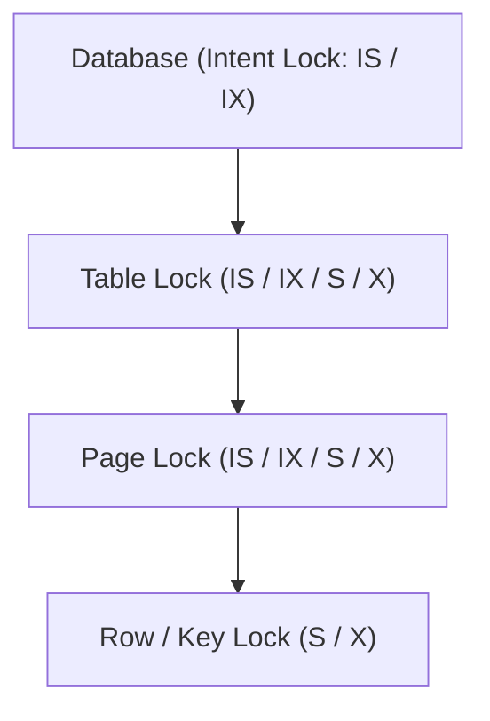

# Module 04: Concurrency, MVCC, Locking & Transaction Anomalies

---

## 1. The Real ANSI Isolation Matrix & Modern Anomalies

While textbooks list four ANSI isolation levels, modern MVCC-based relational databases (PostgreSQL, MySQL InnoDB, Oracle, SQL Server with RCSI) introduce **Snapshot Isolation**, which breaks traditional ANSI definitions.

```
                ┌──────────────────────────────────────────────────────────┐
                │          Transaction Isolation Anomaly Matrix            │
                └──────────────────────────────────────────────────────────┘
```

| Isolation Level | Dirty Read | Non-Repeatable Read | Phantom Read | **Lost Update** | **Write Skew** |
| :--- | :---: | :---: | :---: | :---: | :---: |
| **Read Uncommitted** | ⚠️ Allowed | ⚠️ Allowed | ⚠️ Allowed | ⚠️ Allowed | ⚠️ Allowed |
| **Read Committed** | 🛡️ Prevented | ⚠️ Allowed | ⚠️ Allowed | ⚠️ Allowed | ⚠️ Allowed |
| **Repeatable Read** | 🛡️ Prevented | 🛡️ Prevented | ⚠️ Allowed (ANSI) / 🛡️ (MVCC) | 🛡️ Prevented | ⚠️ **Allowed!** |
| **Snapshot Isolation** | 🛡️ Prevented | 🛡️ Prevented | 🛡️ Prevented | 🛡️ Prevented | ⚠️ **Allowed!** |
| **Serializable / SSI** | 🛡️ Prevented | 🛡️ Prevented | 🛡️ Prevented | 🛡️ Prevented | 🛡️ **Prevented** |

---

## 2. Multi-Version Concurrency Control (MVCC) Internals

The core philosophy of MVCC: **"Readers do not block Writers, and Writers do not block Readers."**

### How Engines Implement MVCC:

```mermaid
graph TD
    subgraph Postgres["PostgreSQL: Append-Only In-Place"]
        P1["Row Header: xmin (creating tx), xmax (deleting/updating tx)"] --> P2["UPDATE creates a NEW physical tuple row version"]
        P2 --> P3["VACUUM process required to clean up Dead Tuples (Bloat)"]
    end
    subgraph MySQL["MySQL InnoDB: Rollback Segments"]
        M1["Single clustered index row points to latest state"] --> M2["Undo Log contains reverse delta chain to reconstruct past snapshots"]
        M2 --> M3["Purge thread reclaims undo logs once oldest read transaction completes"]
    end
    subgraph SQLServer["SQL Server: TempDB Version Store"]
        S1["Rows in data pages point to row versions stored in TempDB"] --> S2["Garbage collection cleans versions from TempDB"]
    end
```



---

## 3. The Wilderness Boss Anomaly: Write Skew

### Definition:
**Write Skew** occurs when two concurrent transactions read overlapping data sets, evaluate an invariant/constraint, and then perform updates on **disjoint** rows such that the combined result violates the system invariant.

### The Classic "On-Call Doctors" Problem:
- **Invariant**: There must always be **at least 1 doctor on call** for the hospital.
- Current state: Alice and Bob are both on call (`is_on_call = TRUE`, count = 2).

```mermaid
sequenceDiagram
    autonumber
    actor Alice as Alice's Transaction (T1)
    actor Bob as Bob's Transaction (T2)
    participant DB as Database (Snapshot Isolation)

    Note over Alice,Bob: Both start at Snapshot S0 (Active Doctors = 2)
    Alice->>DB: SELECT COUNT(*) FROM Doctors WHERE is_on_call = TRUE; -- returns 2
    Bob->>DB: SELECT COUNT(*) FROM Doctors WHERE is_on_call = TRUE; -- returns 2
    
    Note over Alice: Count >= 2, safe to go off-call
    Alice->>DB: UPDATE Doctors SET is_on_call = FALSE WHERE name = 'Alice';
    
    Note over Bob: Count >= 2, safe to go off-call
    Bob->>DB: UPDATE Doctors SET is_on_call = FALSE WHERE name = 'Bob';

    Alice->>DB: COMMIT; -- SUCCESS (Modified row 'Alice')
    Bob->>DB: COMMIT; -- SUCCESS (Modified row 'Bob' - No row-level conflict!)

    Note over DB: CRITICAL BUG: Active Doctors = 0! Invariant Violated!
```

### Why Snapshot Isolation Fails to Stop Write Skew:
Under Snapshot Isolation (and standard Repeatable Read in Postgres/Oracle), write conflicts are only triggered when two transactions update the **same physical row** (First-Committer-Wins rule). Since Alice updated row `Alice` and Bob updated row `Bob`, no physical row collision occurred!

### How to Fix Write Skew:
1. **True Serializability (SSI / Serializable Isolation)**:
   - Database tracks read/write dependencies (SIREAD locks in PostgreSQL) and aborts one transaction with a serialization failure (`40001`).
2. **Pessimistic Locking (`SELECT FOR UPDATE`)**:
   ```sql
   BEGIN;
   -- Lock all rows in the evaluated set:
   SELECT COUNT(*) FROM Doctors WHERE is_on_call = TRUE FOR UPDATE;
   -- Perform check and update...
   UPDATE Doctors SET is_on_call = FALSE WHERE name = 'Alice';
   COMMIT;
   ```
3. **Explicit Materialized Conflict / Invariant Constraint Table**:
   - Both transactions update a single counter row in a summary table, forcing a physical row lock conflict.

---

## 4. Lock Types, Hierarchy & Deadlocks



### Lock Modes:
- **Shared (S)**: Read locks. Multiple transactions can hold S locks simultaneously.
- **Exclusive (X)**: Write locks. Only one transaction can hold an X lock; blocks all other S and X locks.
- **Intent Locks (IS, IX, SIX)**: Placed on higher hierarchical nodes (table/page) to signal that lower-level row locks exist, preventing another transaction from obtaining a table-level exclusive lock.

### Deadlocks & Deadlock Graph:
A **Deadlock** occurs when two or more transactions form a circular dependency waiting for locks held by each other:
$$\text{Tx1 holds Lock A, wants Lock B} \longleftrightarrow \text{Tx2 holds Lock B, wants Lock A}$$

- **Detection**: The database engine runs a background **Deadlock Detector thread** (every 100ms–5000ms) that inspects the *Wait-For Graph*.
- **Resolution**: The engine selects a **Victim transaction** (typically the one with the lowest rollback cost/log bytes generated), rolls it back, and throws a deadlock exception to the application.
- **Prevention Best Practice**: Always access and lock resources in a **consistent global order** across all application queries (e.g., always update accounts in order of `account_id ASC`).
